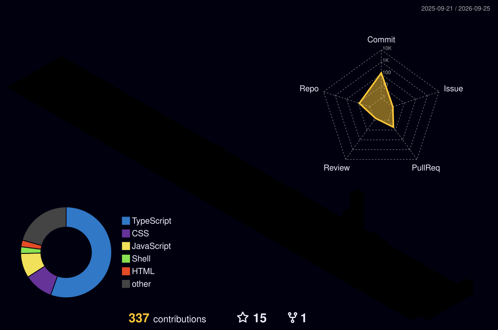

<!-- Header Banner -->

  
  
   
  
  
  
   

  

    
    
    
  

  

    
    
  

  

 

  <h2>👨‍💻 About Me</h2>

* 🎓 3rd-year **B.Tech in Computer Science & Engineering** at Uttaranchal University, Dehradun (2023–2027)
* 💻 Frontend-leaning full-stack developer — **React.js**, **Django REST Framework**, **Python**, **JavaScript**
* 🔐 Into application security — **JWT**, **OAuth**, and encryption (**AES-256-GCM**, **ChaCha20-Poly1305**)
* 🚀 Building **DevSync**, a React + DRF team-matching platform with 150+ active users and JWT/OAuth-secured ERP integration
* 🛡️ Co-creator of **HOPE OS / Trust Exam Shield** — an offline, kiosk-mode Arch Linux exam OS with dual-layer cascade encryption, built for the Zuup Far Away Hackathon 2026
* 🏆 Selected for **Smart India Hackathon 2024**; also competed at **SSCBS Hackathon 2026** and **JIC 2026** (180 Degrees Consulting case competition)
* ✍️ Senior Executive Member, **Literary Committee**, Uttaranchal University
* 🎮 Outside of code: gaming, music, traveling, and cooking

---

  <h2>🛠️ Tech Stack</h2>

  

---

  <h2>🌟 Featured Projects</h2>

* **[DevSync](https://devsync-connect.pages.dev/)** — Team-matching platform for collaborative projects (React.js · DRF · JWT/OAuth · 150+ users)
* **HOPE OS / Trust Exam Shield** — Offline exam kiosk OS with dual-layer encryption (Arch Linux · Python/GTK4 · AES-256-GCM)
* **SIH 2024 — Automated Bus Scheduling** — Route & scheduling system for Delhi Transport Corporation

---

  <h2>📊 Performance Ecosystem</h2>

  

 

  
  

  
  
  

  

---

  <h2>🎮 Contribution Animations</h2>
  
<i>Note: These will appear after the respective GitHub Actions run successfully!</i>

  
<b>🐍 View GitHub Snake (Click to Expand)</b>

   
  

    <picture>
      <source media="(prefers-color-scheme: dark)" srcset="https://raw.githubusercontent.com/Ansh-gupta-07/Ansh-gupta-07/output/github-contribution-grid-snake-dark.svg" />
      <source media="(prefers-color-scheme: light)" srcset="https://raw.githubusercontent.com/Ansh-gupta-07/Ansh-gupta-07/output/github-contribution-grid-snake.svg" />
      
    </picture>
  

  
<b>👻 View Pac-Man vs Commits (Click to Expand)</b>

   
  

    <picture>
      <source media="(prefers-color-scheme: dark)" srcset="https://raw.githubusercontent.com/Ansh-gupta-07/Ansh-gupta-07/output/pacman-contribution-graph-dark.svg" />
      <source media="(prefers-color-scheme: light)" srcset="https://raw.githubusercontent.com/Ansh-gupta-07/Ansh-gupta-07/output/pacman-contribution-graph.svg" />
      
    </picture>
  

  
<b>📅 View 3D Contribution Calendar (Click to Expand)</b>

   
  

    <picture>
      <source media="(prefers-color-scheme: dark)" srcset="./profile-3d-contrib/profile-night-rainbow.svg" />
      <source media="(prefers-color-scheme: light)" srcset="./profile-3d-contrib/profile-green-animate.svg" />
      
    </picture>
  

<!-- Footer Banner -->

  

